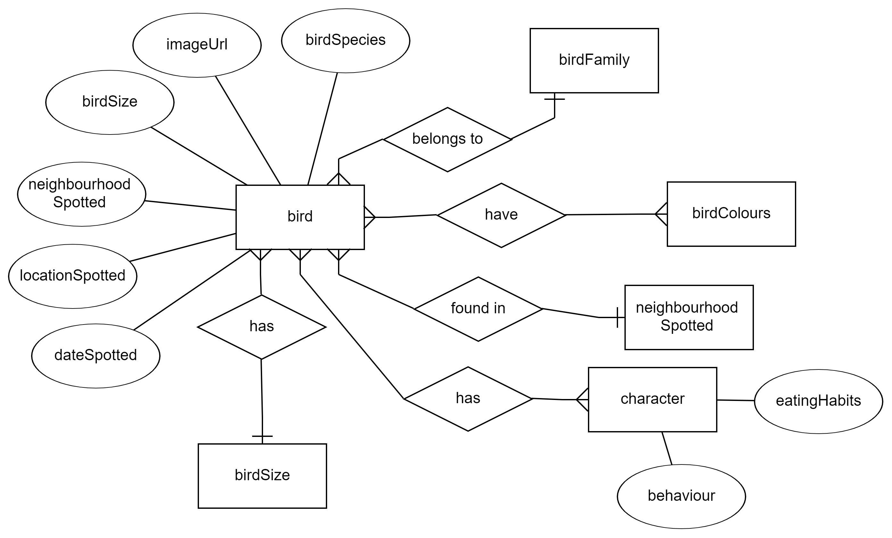
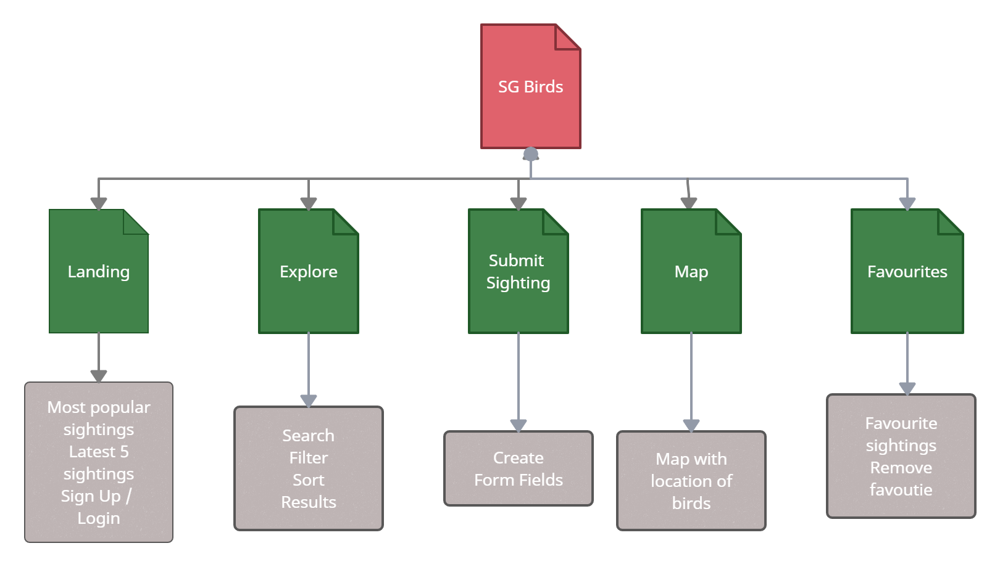

# SG Birds

## Background

## Project Overview

For bird enthusiasts in Singapore, their main concerns will be where they can find birds to watch or take photos of, and to update like-minded enthusiasts of where to find certain species of birds in Singapore.

## The Five Planes UI/UX

### Strategy

#### Organisation's Goals
To create a community for fellow birds watching and phototaking enthusiasts to communicate and help one another find find the birds they are looking for.

#### User's Goals
As a bird watcher using the website, I want to be able to share with fellow bird watching enthusiasts birds that I have spotted.

As a bird watcher using the website, I want to be able to find location of birds that I am interested in, so I can go down and take photos of them.

As a bird watcher using the website, I want to find fellow bird watchers to communicate and share my experiences with.

1. **Organisation**
    - Objective: To have a centralised space to contribute and search for different birds in Singapore.
    - Needs:
        - To search for different bird species in Singapore
        - To be able to contribute after spotting a bird
    - Demographics and charactertistics:
        - Teens and adults
        - Enthusiastic about birds and/or photography
        - Used to browsing the internet
    - Pain point:
        - Need to out about locations for a bird species that the user wants to watch or take photos of

User Stories | Acceptance Criteria(s)
------------ | -------------
As a bird watcher using the website, I want to be able to share with fellow bird watching enthusiasts birds that I have spotted. | Users should be able to easily share the location where they have spotted the birds at by the neighbourhood it was spoteted at and the latitude and longitude through usage of a map.
As a bird watcher using the website, I want to be able to find location of birds that I am interested in, so I can go down and take photos of them. | Birds should be searchable by the bird family it belongs to and user should be able to find the location it was spotted at easily.
As a bird watcher using the website, I want to find fellow bird watchers to communicate and exchange my experiences with.| Users should be able to comment on each others bird findings to encourage users to post and communicate with one another.

### Scope

####
Database 

<figure>
    
</figure>

ERD is drawn up to demonstrate the different relationship between enitities for the site before proceeding to model the database in MongoDB.

#### Content
Content in the website will be crowd sourced from the public and therefore, clear presentation of data contributed by users is essential. A landing page is included as well to showcase our branding and allow users to understand hat our website is about at a glance.

#### Functional
- Search function against attributes such as bird family and tags.
- Filter function of all sightings posted based on bird size, bird colours and neighbourhood spotted.
- Create new sighting function
- Edit and Delete function of each sighting
- Commenting function of each sighting
- Add and remove function of each sighting to user's favourites
- Registration and verification on email is included for actions performed on sightings, favourites and commenting

#### Non-functional
- Mobile responsiveness: Website should be mobile first and users should be able to navigate th webiste comfortably on their mobile devices.
- Accesibility:

### Structure

<figure>
    
</figure>

### Skeleton

#### Colour Scheme